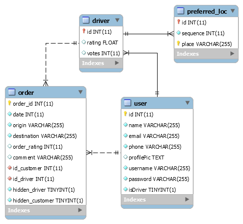
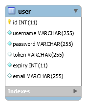

# Tugas 2 IF3110 Pengembangan Aplikasi Berbasis Web

### Anggota Kelompok
- Reinhard Benjamin Linardi (13515011)
- Vincent Hendryanto Halim (13515089)
- Roland Hartanto (13515107)

### Spesifikasi Tugas 

Melakukan *upgrade* Website ojek online sederhana pada Tugas 1 dengan mengaplikasikan **arsitektur web service REST dan SOAP**.

#### Login
1. Pengguna mengakses halaman login, contoh: `/login.jsp` dan mengisi form.
2. JSP akan membuka HTTP request ke Identity Service, contoh `POST /login` dengan body data email dan password.
3. Identity service akan melakukan query ke DB untuk mengetahui apakah email dan password tersebut valid.
4. Identity service akan memberikan HTTP response `access token` dan `expiry time` jika email dan password ada di dalam DB, atau error jika tidak ditemukan data. Silakan definisikan `expiry time` yang menurut Anda sesuai.
5. Access token ini digunakan sebagai representasi state dari session pengguna dan harus dikirimkan ketika pengguna ingin melakukan semua aktivitas, kecuali login, register, dan logout. 
6. Access token dibangkitkan secara random. Silakan definisikan sendiri panjang tokennya.
7. Cara penyimpanan access token dibebaskan.
8. Silakan definisikan format request dan response sesuai kebutuhan anda. Anda dapat menggunakan JSON atau XML untuk REST.

#### Register
1. Pengguna mengakses halaman register, contoh: `/register.jsp` dan mengisi form.
2. JSP akan melakukan HTTP request ke Identity Service, contoh `POST /register` dengan body data yang dibutuhkan untuk registrasi.
3. Identity service akan query DB untuk melakukan validasi bahwa email dan username belum pernah terdaftar sebelumnya.
4. Identity service akan menambahkan user ke DB bila validasi berhasil, atau memberi HTTP response error jika username sudah ada atau confirm password salah.
5. Identity service akan memberikan HTTP response `access token` dan `expiry time` dan user akan ter-login ke halaman profile bila user merupakan driver atau ke halaman order bila user bukan merupakan driver.
6. Silakan definisikan format request dan response sesuai kebutuhan anda. Anda dapat menggunakan JSON atau XML untuk REST.

#### Logout
1. Pengguna menekan tombol logout.
2. JSP akan melakukan HTTP request ke Identity Service, contoh `POST /logout` dengan body data yang dibutuhkan.
3. Identity service akan menghapus atau melakukan invalidasi terhadap access token yang diberikan.
4. Identity service akan mengembalikan HTTP response berhasil.
5. Halaman di-*redirect* ke halaman login.

#### Add Preferred Location, Make an Order, dll
1. Pengguna mengakses halaman add preferred location, misal `/add-preferred-location.jsp` dan mengisi form.
2. JSP akan memanggil fungsi pada *ojek online web service* dengan SOAP, misalnya `addPreferredLocation(access_token, location)`. Contohnya, dapat dilihat pada
[link berikut](http://www.mkyong.com/webservices/jax-ws/jax-ws-hello-world-example/)
Perhatikan pemanggilan pada contoh ini seperti melakukan remote procedure call.
3. Fungsi tersebut akan melakukan HTTP request ke Identity Service, untuk mengenali user dengan `access_token` yang diberikan.
    - Jika `access_token` **kadaluarsa**, maka `addPreferredLocation` akan memberikan response expired token.
    - Jika `access_token` **tidak valid**, maka `addPreferredLocation` akan memberikan response error ke JSP.
    - Jika `access_token` **valid**, maka `addPreferredLocation` akan memasukan produk ke DB, dan memberikan response kesuksesan ke JSP.
4. Jika `access_token` sudah kadaluarsa atau tidak valid (yang diketahui dari response error ojek online web service), sistem akan me-redirect user ke halaman login.
5. Untuk make an order, get history, dan lainnya kira-kira memiliki mekanisme yang sama dengan add preferred locations di atas.
6. Silakan definisikan format object request dan response sesuai kebutuhan anda.

#### Bonus
Anda tidak dituntut untuk mengerjakan ini. Fokus terlebih dahulu menyelesaikan semua spesifikasi yang ada sebelum memikirkan bonus.
- Mekanisme *auto-renew* access token yang tepat sehingga user tidak ter-logout secara paksa saat melakukan serangkaian aktivitas pada sistem dalam waktu yang cukup lama. Access token dapat di generate kembali ketika lifetime dari token tersebut habis. Cara implementasi dibebaskan.

### Penjelasan

#### Database
Skema database pada Ojek Online Web Service (SOAP) :  
  

Skema database pada Identity Service (REST) :  
  

#### Shared Session
Shared session dengan menggunakan REST memanfaatkan token yang digenerate oleh web service REST. Karena REST bersifat stateless, maka penanganan session akan dilakukan dengan memanfaatkan token.
Token memiliki waktu kadaluarsa (expire time). Token akan divalidasi setiap kali user akan melakukan aksi yang memerlukan penggunaan session. Ketika waktu expire token habis, expire token dapat diperpanjang.

#### Token generation dan expire time
Token generation dilakukan secara random menggunakan PRNG. Untuk memperpendek token, maka digunakan hash dari token dan diambil beberapa karakter saja. Expire time saat token generation adalah 15 menit. Jika user masih login pada saat expire time maka token akan di-renew secara otomatis. Pada saat logout, token di-set menjadi NULL.

#### Kelebihan dan kelemahan sistem dibandingkan dengan aplikasi monolitik
Kelebihan :
1. Tidak memerlukan penyimpanan session
2. Beban server menjadi lebih ringan
3. Token dapat digunakan oleh aplikasi lain

Kelemahan :
1. User perlu melakukan banyak request
2. Database harus tersinkronisasi

### Pembagian Tugas

REST :
1. Generate token : 13515011
2. Login : 13515011
3. Logout : 13515011
4. Register : 13515107
5. Validate token : 13515089
6. Database : 13515011

SOAP :
1. All Interface : 13515089
2. History : 13515011
3. PrefLocImpl : 13515107
4. OrderImpl : 13515107
5. ProfileImpl : 13515107
6. TokenValidator : 13515089
7. Database : 13515011
8. HttpRequest : 13515089

Web app (Servlet) :
1. All Interface : 13515089 
2. Profile Picture : 13515089
3. AddLocation : 13515107
4. DeleteLocation : 13515107
5. HideHistory : 13515011
6. Login, Register : 13515089
7. SaveOrder : 13515089
8. UpdateLocation : 13515107
9. UpdateProfile : 13515011

Web app (JSP) :
1. History : 13515011 & 13515107
2. Login, Register, Logout : 13515089
3. Order : 13515089
4. Profile : 13515011 & 13515107

### About

Asisten IF3110 2017

Ade | Johan | Kristianto | Micky | Michael | Rangga | Raudi | Robert | Sashi 

Dosen : Yudistira Dwi Wardhana | Riza Satria Perdana | Muhammad Zuhri Catur Candra