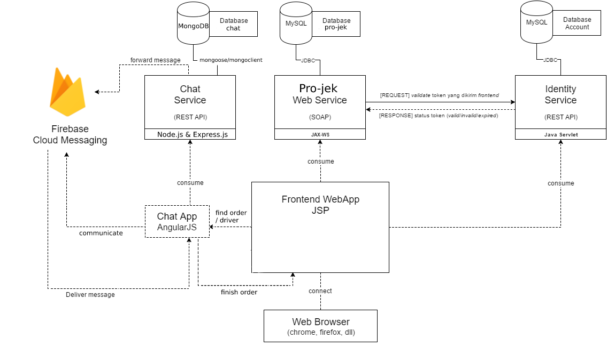
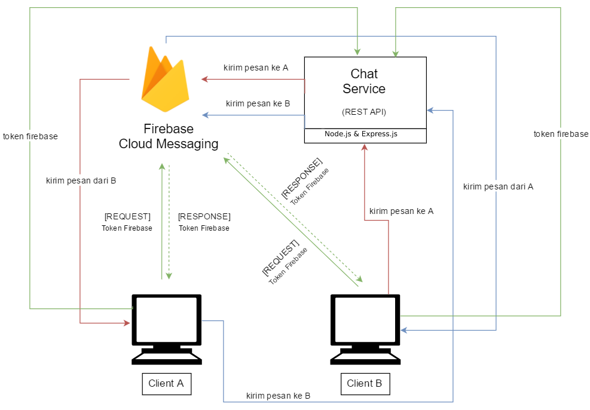
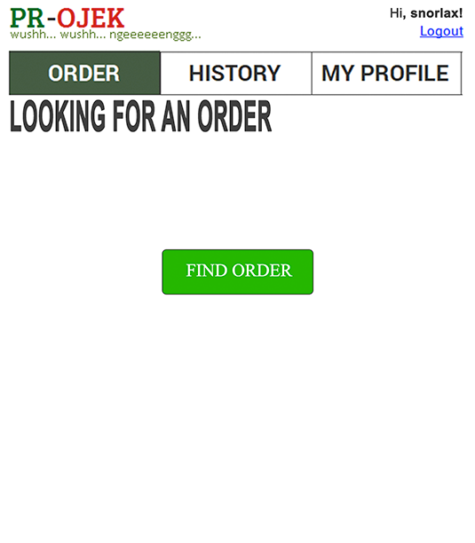
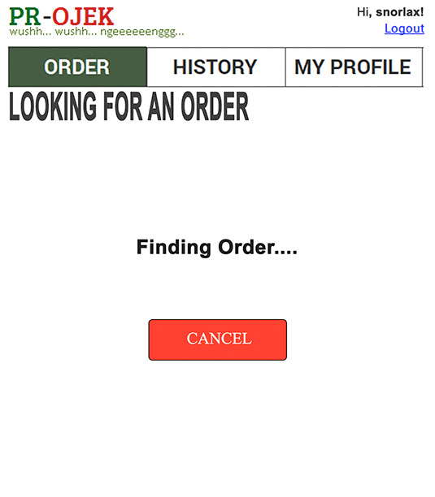
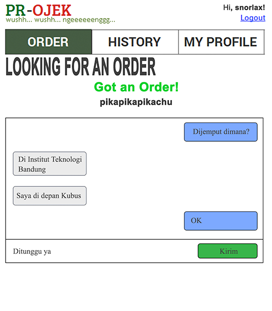
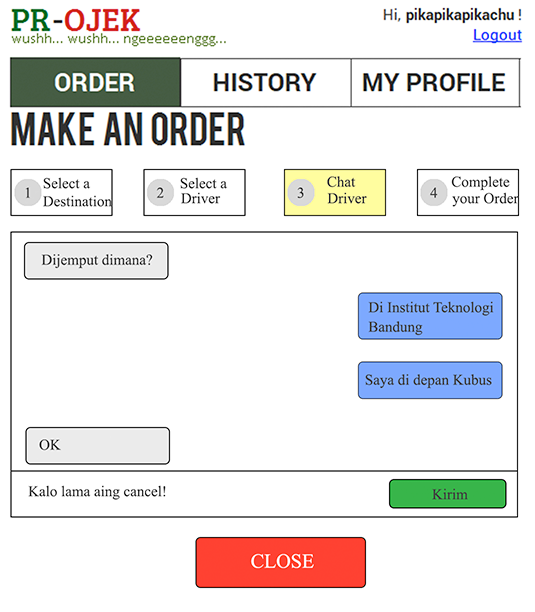

# Tugas 3 IF3110 Pengembangan Aplikasi Berbasis Web

Melakukan upgrade Website ojek online sederhana pada Tugas 2 dengan mengaplikasikan ***cloud service* (Firebase Cloud Messaging) dan *framework* MEAN stack**.

**Luangkan waktu untuk membaca spek ini sampai selesai. Kerjakan hal yang perlu saja.**

## Tujuan Pembuatan Tugas

Diharapkan dengan tugas ini Anda dapat mengerti:
* MEAN stack (Mongo, Express, Angular, dan Node)
* *Cloud service* Firebase Cloud Messaging (FCM) dan kegunaannya.
* Web security terkait access token dan HTTP Headers.

## Anggota Tim
Setiap kelompok beranggotakan **3 orang dari kelas yang sama**. Jika jumlah mahasiswa dalam satu kelas modulo 3 menghasilkan 1, maka hanya 1 kelompok terdiri dari 4 mahasiswa. Jika jumlah mahasiswa modulo 3 menghasilkan 2, maka ada dua kelompok yang beranggotakan 4 orang. Anggota kelompok harus berbeda dengan tugas 1 dan tugas 2.

## Petunjuk Pengerjaan
1. Buatlah organisasi pada gitlab dengan format "IF3110-2017-KXX-nama kelompok", dengan XX adalah nomor kelas.
2. Tambahkan anggota tim pada organisasi anda.
3. Fork pada repository ini dengan organisasi yang telah dibuat.
4. Ubah hak akses repository hasil Fork anda menjadi **private**.
5. [DELIVERABLE] Buat tugas sesuai spesifikasi dan silakan commit pada repository anda (hasil fork). Lakukan berberapa commit dengan pesan yang bermakna, contoh: `add register form`, `fix logout bug`, jangan seperti `final`, `benerin dikit`. Disarankan untuk tidak melakukan commit dengan perubahan yang besar karena akan mempengaruhi penilaian (contoh: hanya melakukan satu commit kemudian dikumpulkan). Sebaiknya commit dilakukan setiap ada penambahan fitur. **Commit dari setiap anggota tim akan mempengaruhi penilaian individu.** Jadi, setiap anggota tim harus melakukan sejumlah commit yang berpengaruh terhadap proses pembuatan aplikasi.
6. Edit file readme ini semenarik mungkin (gunakan panduan Markdown language), diperbolehkan untuk merubah struktur dari readme ini. (Soal tidak perlu dipertahankan).
7. Pada Readme terdapat tampilan aplikasi dan penjelasan mengenai pembagian tugas masing-masing anggota (lihat formatnya pada bagian **pembagian tugas**).
8. Merge request dari repository anda ke repository ini dengan format **Nama kelompok** - **NIM terkecil** - **Nama Lengkap dengan NIM terkecil** sebelum **Senin, 27 November 2017 23.59**.

### Arsitektur Umum
Tugas 3 ini terdiri dari komponen Tugas 2 dan tambahan yang harus dibuat:
* `Pemanfaatan FCM`: Pengiriman pesan dari pelanggan ke driver atau sebaliknya dengan menggunakan layanan Firebase Cloud Messaging (FCM).
* `Implementasi MEAN stack`: Membuat REST service untuk keperluan layanan chat memanfaatkan FCM menggunakan Node, Express dan Mongo, serta membuat halaman chat yang menggunakan Angular.

### Deskripsi Tugas
Kali ini, Anda diminta untuk merubah sedikit fungsionalitas order yang sudah ada dan menambah fungsionalitas chat pada aplikasi yang telah anda buat pada tugas 2. Aplikasi ini akan menggunakan MEAN stack untuk halaman chat dan REST service, serta menggunakan layanan cloud Firebase Cloud Messaging sebagai media penyampaian pesan. Selain itu, Anda juga diminta untuk mengimplementasikan beberapa fitur security. Spesifikasi untuk tugas ini adalah sebagai berikut:

1. Halaman Order akan bergantung pada status pengguna, apakah driver atau bukan.
2. Bila status pengguna merupakan driver maka pada halaman order akan ditampilkan fitur finding order dimana akan membuat driver visible ketika user ingin melakukan order pada halaman select driver. Apabila driver tidak melakukan finding order, maka driver tidak akan ditampilkan pada halaman select driver ketika pengguna non driver melakukan order.
3. Pengguna dapat saling bertukar pesan dengan driver secara realtime di halaman order chat driver. Fitur ini harus diimplementasikan dengan MEAN stack, di mana fitur halmaman chat harus diimplementasikan dengan Angular dan fitur REST service diimplementasikan menggunakan Node, Express, dan Mongo.
4. REST service yang akan menghubungkan client dan Firebase Cloud Messaging. Rincian service ini akan dijelaskan kemudian. Silahkan pelajari cara mendaftar ke layanan Firebase, dan cara membuat project baru.
5. Pengguna harus login terlebih dahulu sebelum dapat melakukan chat. Silahkan cari cara untuk sharing session antara JSP dan MEAN. Sebagai contoh, anda dapat menggunakan cookie yang dapat diakses oleh keduanya.
6. Pada halaman order select driver, aplikasi hanya menampilkan driver yang **sesuai requirement** saja (lihat poin 7). Ketika nama driver dipilih, maka akan muncul kotak chat antar pengguna non driver dan driver pada tab chat driver di halaman order.
7. Requirement yang dimaksud ialah driver memiliki preferred location yang dituju pengguna, online, **sedang melakukan finding order**, dan tidak sedang mendapat order.
8. Pengguna dengan IP address yang berbeda tidak dapat menggunakan access token yang sama.
9. Pengguna dengan user-agent yang berbeda tidak dapat menggunakan access token yang sama. Dalam hal ini, user-agent yang dimaksud adalah web browser yang digunakan.
10. Komponen yang harus digunakan pada AngularJS adalah:
    * Data binding (ng-model directives)
    * Controllers (ng-controllers)
    * ng-repeat, untuk menampilkan list
    * $http untuk AJAX request
    * $scope untuk komunikasi data antara controller dengan view.
    * ng-show dan ng-hide untuk menampilkan/menyembunyikan elemen
11. Tidak perlu memperhatikan aspek keamanan dan etika dalam penyimpanan data.

### Rincian REST Service
1. REST service untuk keperluan chatting **wajib** diimplementasikan dengan **Node dan Express**.
2. REST service menangani hal-hal sebagai berikut.
    * Memberikan daftar driver yang sesuai requirement (sesuai deskripsi tugas nomor 7)
    * Menyimpan identitas (token FCM) dari masing-masing pengguna yang sedang online
    * Menerima *request* dari user A untuk chat ke user B, lalu membuat *request* ke FCM untuk pengiriman pesan ke token FCM user B.
    * Menyimpan ke basis data history chat dari seorang pemesan dan seorang driver. Misalkan A pernah memesan driver B. Jika suatu saat A akan memesan lagi ke driver B, maka kotak chat menampilkan chat yang dilakukan pada pemesanan sebelumnya.
3. Untuk penyimpanan history chat, basis data yang digunakan **wajib Mongo**. Anda tidak diperkenankan menggunakan basis data yang lain, termasuk layanan Firebase Database.

### Halaman Tambahan
1. Halaman Order pada pengguna non driver, terdapat tambahan chat driver pada tahap ketiga
2. Halaman Order pada pengguna driver

### Rincian Arsitektur Aplikasi Chat

Proses untuk komunikasi antar client adalah sebagai berikut:
1. Ketika client dijalankan, client akan meminta token (token yang berbeda dengan token untuk authentication dari Identity Service) dari FCM.
2. FCM mengirimkan token ke client.
3. Setelah token diterima, client akan mengirim token serta identitas dari client (nama/email) ke chat server. Identitas client digunakan untuk mengidentifikasi kepemilikan token.
4. Untuk mengirim pesan kepada client lain, client pertama mengirimkan pesan yang berisi identitas pengirim, identitas tujuan, dan isi pesan ke chat server.
5. Chat server kemudian akan mencari token yang terkait dengan identitas tujuan.
6. Chat server lalu mengirim request ke FCM untuk mengirimkan pesan kepada client dangan token yang terkait.
7. FCM mengirimkan pesan kepada tujuan.

### Asumsi yang Digunakan
1. Pada tugas ini, diasumsikan kedua client sedang aktif. Aplikasi hanya akan dijalankan pada localhost, sehingga memerlukan 2 browser yang berbeda untuk mensimulasikan client yang berbeda. Aplikasi berjalan pada localhost karena browser mensyaratkan sumber aplikasi harus aman untuk operasi-operasi yang digunakan pada aplikasi ini. Localhost termasuk lokasi yang diperbolehkan oleh browser.
2. Kedua browser tersebut harus dalam keadaan aktif dan terfokus, serta tidak terminimize. Hal ini karena cara kerja service worker, yang hanya dapat memberikan notifikasi, dan tidak dapat melakukan manipulasi halaman apabila web browser tidak sedang terfokus ketika pesan datang.
Selain itu, seorang pengguna hanya dapat chatting dengan 1 pengguna lain dalam 1 waktu, sehingga hanya 1 kotak chat yang ditampilkan.
3. Driver hanya dapat menerima satu order dari satu user pada satu waktu.

### Skenario Chatting
Skenario penggunaan aplikasi adalah sebagai berikut.
Misal pengguna A adalah non driver, dan pengguna B adalah driver.
1. A dan B login untuk masuk ke aplikasi.
2. B melakukan finding order pada halaman Order. A memasuki halaman Order.
3. A melakukan order dan memilih driver yang sedang online dan tersedia (driver B).
4. Kotak chat akan muncul di halaman Chat Driver pada layar A. Kotak chat juga akan muncul pada halaman Order pada B.
5. A mengetikkan pesan, dan menekan tombol kirim.
6. Pesan dikirim ke B melalui chat server dan FCM.
7. Ketika pesan sudah diterima di B, kotak chat pada layar B akan muncul.
8. B dapat membalas chat dari A.
9. Apabila A sudah melakukan submit rating maka chatbox pada B akan hilang dan kembali menampilkan halaman finding order.

### Skenario Umum Program
Skenario program selain chat, pada umumnya sama seperti tugas 2. Akan tetapi, metode pengecekan token pada identity service sedikit berbeda.

Identity Service harus mengecek:
1. Apakah access token ini sudah kadaluarsa?
2. Apakah access token ini digunakan pada browser yang berbeda?
3. Apakah access token ini digunakan dengan koneksi internet yang berbeda?

Jika jawaban salah satu pertanyaan tersebut adalah "ya", maka identity service akan memberikan respon error dan detail errornya.

### Mekanisme pembuatan token
Token anda harus mempunyai informasi terkait browser (user agent) dan IP address dari pengguna. Identity service harus dapat mengekstrak informasi tersebut. Sebagai contoh, anda dapat melakukan (tidak harus) konstruksi token dengan `format:some_random_string#user_agent#ip_address`. Jika pada tugas 2 token anda adalah abcdefgh Maka pada tugas 3 token anda adalah `abcdefgh#Mozilla/5.0 (Windows NT 6.3; WOW64) AppleWebKit/537.36 (KHTML, like Gecko) Chrome/46.0.2490.86 Safari/537.36#167.205.22.104`.

Token tidak perlu dienkripsi-dekripsi (for simplicity)

### Tampilan Program
Halaman Order pada Driver

Halaman Order pada Driver Ketika Melakukan Finding Order

Halaman Order pada Driver Ketika Mendapat Order

Halaman Order pada Pengguna, Chat Driver

Perlu diperhatikan bahwa chat yang dikirim oleh user yang sedang login berada disisi sebelah kanan dan lawan chatnya lain di sisi sebelah kirim. Isi chat jga harus ditampilkan sesuai urutan waktu diterima (paling atas adalah chat paling lama dan makin ke bawah chat makin baru).

### Referensi Terkait
Berikut adalah referensi yang dapat Anda baca terkait tugas ini:
1. https://firebase.google.com/docs/web/setup
2. https://firebase.google.com/docs/cloud-messaging/js/client
3. https://docs.angularjs.org/api

Selain itu, silahkan cari "user agent parser", "how to get my IP from HTTPServletRequest", dan "HTTP Headers field" untuk penjelasan lebih lanjut.

### Prosedur Demo
Sebelum demo, asisten akan melakukan checkout ke hash commit terakhir yang dilakukan sebelum deadline. Hal ini digunakan untuk memastikan kode yang akan didemokan adalah kode yang terakhir disubmit sebelum deadline.

### Pembagian Tugas

Tugas kali ini cukup rumit, karena melibatkan layanan dari pihak ketiga, dan framework. Bila tak mengerti, luangkan waktu belajar lebih banyak. Bila belum juga mengerti, belajarlah bersama-sama kelompokmu. Bila Anda sekelompok bingung, bertanyalah (bukan menyontek) ke teman seangkatanmu. Bila seangkatan bingung, bertanyalah pada asisten manapun.

Harap semua anggota kelompok mengerjakan baik implementasi Firebase sebagai *cloud service* maupun *framework* AngularJS. Tuliskan pembagian tugas seperti berikut ini.

Chat App Front-end :
1. Fungsionalitas A : 135140XX  
2. Fungsionalitas B : 135140XX  

Chat REST Service:  
1. Fungsionalitas C : 135140XX  
2. Fungsionalitas D : 135140XX  

Fitur security (IP, User-agent) :
1. Fungsionalitas E : 135140XX
2. Fungsionalitas F : 135140XX

## About

Asisten IF3110 2016

Ade | Johan | Kristianto | Micky | Michael | Rangga | Raudi | Robert | Sashi

Dosen : Yudistira Dwi Wardhana | Riza Satria Perdana | Muhammad Zuhri Catur Candra
